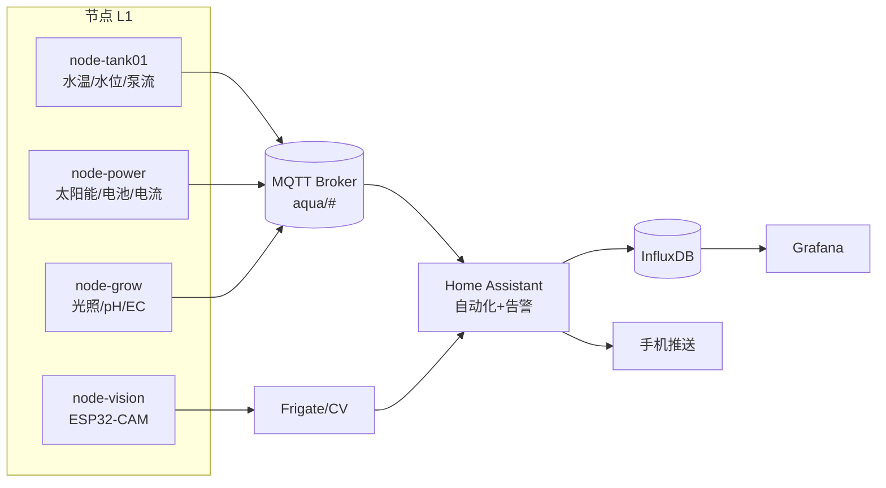

# 第 3 章 · 系统架构总览

> 稳定。本章给出系统的分层模型、物理拓扑与数据流。细节在各模块章展开。

## 3.1 两条主线：水与信息

整个系统由两条并行的"回路"交织而成：

- **水回路（物质流）**：单泵驱动，水在缸、过滤、集水桶之间循环，携带养分与废物。
- **信息回路（数据流）**：传感器采集 → 节点上报 → 中枢决策 → 执行器动作，形成反馈控制。

铁律一（失效安全）要求：**水回路能在信息回路完全失效时独立生存**。这是两条主线的从属关系——信息优化水，但不主宰水的存亡。

## 3.2 五层架构

```
┌─────────────────────────────────────────────────────────┐
│ L4 智能层   CV 认鱼 / 行为分析 · LLM 日报 · 决策辅助          │
├─────────────────────────────────────────────────────────┤
│ L3 数据层   InfluxDB 时序库 · Grafana 仪表盘 · Frigate 视觉   │
├─────────────────────────────────────────────────────────┤
│ L2 中枢层   Home Assistant · MQTT Broker · Node-RED 逻辑     │
├─────────────────────────────────────────────────────────┤
│ L1 节点层   ESP32 + ESPHome（一模块一节点）· 传感/执行         │
├─────────────────────────────────────────────────────────┤
│ L0 物理层   钟形虹吸 · 恒水位溢流 · 集水桶兜底（零电力失效安全）  │
└─────────────────────────────────────────────────────────┘
```

**关键约束：下层不依赖上层。** L0 无电可活；L1 断网仍能本地控制（含看门狗）；L2 挂了 L1 仍上报/执行本地逻辑；以此类推。越往上越智能，越往下越可靠。

| 层 | 关键技术 | 失效后果 | 恢复策略 |
|---|---|---|---|
| L0 物理 | 虹吸、溢流、重力 | 无（这是底线） | 不适用 |
| L1 节点 | ESP32/ESPHome | 该模块失去自动化，物理仍在 | OTA、看门狗、本地兜底逻辑 |
| L2 中枢 | HA/MQTT | 失去跨模块自动化与告警 | 节点本地保命逻辑 + 断线告警 |
| L3 数据 | InfluxDB/Grafana | 失去历史与视觉 | 控制不受影响 |
| L4 智能 | CV/LLM | 失去"锦上添花" | 控制不受影响 |

## 3.3 物理拓扑（水回路）

采用 **CHOP2（恒水位单泵）**（见 [ADR-0001](../decisions/0001-chop2-single-pump.md)）：

```
        ┌──────────── 供水总管 (每口缸一个球阀) ───────────┐
        │            │             │            │        │
      [缸1]        [缸2]         [缸3]        [种植床]     │  ← 各缸缸口/竖管溢流
        │            │             │            │        │
        └──────────── 回水总管 ───────────────────────────┘
                          │
                    [集水/生化桶]  ←（物理棉→生化滤材→清水仓）
                          │ 单泵(12V/或过渡期25W市电)
                          └──────── 泵回供水总管 ↑ ↺
```

- 重物（集水桶、大缸）落地（见 [ADR-0003](../decisions/0003-heavy-tanks-on-floor.md)）。
- 玻璃缸不钻孔，走缸口溢流（见 [ADR-0002](../decisions/0002-multi-small-glass-tanks.md)）。
- 详见 [第 4 章 水循环](04-hydraulics.md)。

## 3.4 信息拓扑（数据流）



- 所有节点发布到统一命名空间 `aqua/<node>/<metric>`（见 [第 13 章](13-interfaces.md)）。
- HA 订阅、决策、下发命令、推送告警；同时把数据写入 InfluxDB 供 Grafana 长期展示。

## 3.5 供电拓扑

```
太阳能板 → 充电控制器(PWM/MPPT) → 12V 电池 ── 12V DC 母线 ──┬─ 水泵/阀/灯/风扇 (12V)
                                       │                  ├─ DC-DC 降压 5V ─ ESP32 / 传感器
   市电 220V (兜底) ─ 充电器 ──────────┘                  └─ 树莓派 (5V)
```

- 大部分负载原生 12V，符合太阳能直供；逻辑电路经 DC-DC 降 5V/3.3V。
- 市电仅在阴雨/电量低时兜底关键负载（循环、打氧）。详见 [第 6 章 供电](06-power.md)。

## 3.6 模块清单（第二部分逐一展开）

| 编号 | 模块 | 层 | 主要负责人 | 章节 |
|---|---|---|---|---|
| M1 | 水循环与流体 | L0/物理 | 共同 | [第 4 章](04-hydraulics.md) |
| M2 | 结构与机械 | 物理 | 共同 | [第 5 章](05-mechanical.md) |
| M3 | 供电与能源 | L0/L1 | 硬件(EE) | [第 6 章](06-power.md) |
| M4 | 传感器 | L1 | 硬件(EE) | [第 7 章](07-sensors.md) |
| M5 | 执行器与驱动 | L1 | 硬件(EE) | [第 8 章](08-actuators.md) |
| M6 | 控制节点/固件 | L1 | 系统/软件 | [第 9 章](09-firmware.md) |
| M7 | 中枢/网络/自动化 | L2 | 系统/软件 | [第 10 章](10-hub-and-automation.md) |
| M8 | 数据/可视化 | L3 | 系统/软件 | [第 11 章](11-data-and-ai.md) |
| M9 | 视觉/智能 | L4 | 系统/软件 | [第 11 章](11-data-and-ai.md) |
| M10 | 生态/生物 | 物理 | 共同 | [第 12 章](12-biology.md) |

分工细节见 [第 14 章](14-division-of-labor.md)。
